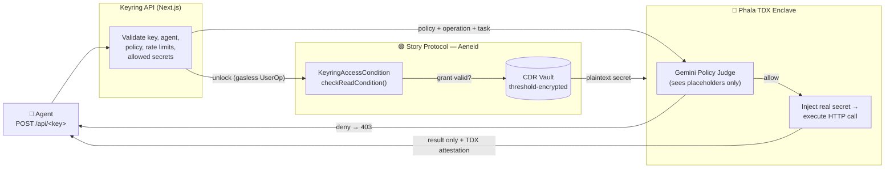

# Keyring

> **Scoped, revocable, metered secret access for AI agents — where the agent uses your secret without ever seeing it.**

Live app: **[keyring-ormp.onrender.com](https://keyring-ormp.onrender.com)** · Demo server: **[keyring-neon.vercel.app](https://keyring-neon.vercel.app)**

[](https://story.foundation)
[](https://story.foundation)
[](https://phala.network)

---

## What is Keyring?

AI agents need your secrets to be useful — your API keys, database passwords, exchange keys. Today you hand them the raw secret as a plaintext environment variable, and from that moment you've lost control: the agent has the key forever, can leak it, and you can't take it back without rotating everything.

**Keyring is a vault that lets an agent *use* a secret without ever *receiving* it.** You store a secret once. You give an agent a plain-English policy ("you may only read from this one API"). When the agent makes a request, Keyring decrypts the secret inside a sealed hardware enclave, an AI judge checks the request against your policy, the secret is injected into the outgoing call, and the agent gets back only the **result** — never the key itself.

- 🧑‍💻 **No blockchain knowledge required.** Sign in with Google, email, or an external wallet. Setup takes a few one-click signatures — no seed phrases, no tokens, nothing else to learn.
- 🔒 **Security is the whole point.** The secret is decrypted only inside an attested Trusted Execution Environment, used once, and wiped. The agent and its host never see it.
- ✨ **Built to be easy.** Create a secret, create an agent, copy an API key. That's it.
- ⛽ **Zero gas, ever.** Every blockchain transaction is sponsored by the protocol. You never pay or hold a single token.

---

## The Problem & How We Solve It

| The problem today | Keyring's answer |
|---|---|
| You give an agent the **raw secret** — permanent exposure. | The agent gets a **result**, never the secret. The key is decrypted only inside a sealed enclave. |
| **No way to revoke** without rotating the secret everywhere. | One on-chain transaction revokes an agent's access instantly, globally. |
| **No scoping** — a key is all-or-nothing. | A natural-language **policy** + an AI judge gate every single request to exactly what you allow. |
| **No metering** — you can't cap how much an agent uses. | Per-agent **rate limits**: all-time, per-minute, per-hour, per-day. |
| Secret managers are **centralized** — trust the host. | Storage is **threshold-encrypted on-chain (CDR)**; access is gated by **on-chain contracts** anyone can audit. |

---

## How It Works

Keyring combines three pieces: **Story Protocol CDR** for encrypted storage, **on-chain contracts** for access control, and a **Phala TDX enclave** for the moment of use.



**How CDR is used.** Every secret is stored as a **Confidential Data Rails (CDR) vault** — threshold-encrypted (TDH2) on Story Protocol. The encrypted data lives on-chain; the key is never in one place. Decryption is gated by our **on-chain condition contract** (`KeyringAccessCondition.checkReadCondition`) — CDR's validator network only releases partial decryptions when that contract returns `true`, which it does only for an agent holding a valid on-chain grant. The plaintext is recombined server-side, handed to the enclave, used once, and discarded.

**How Story Protocol is used.** Keyring runs on the **Aeneid testnet**. On first login, a **per-user pair of contracts** (`AgentRegistry` + `KeyringAccessCondition`) is deployed for you via `KeyringFactory`. Each agent you create is registered as a **Story Protocol IP Asset** (`AgentRegistry.createAgent`, via `RegistrationWorkflows`). Granting and revoking a secret are on-chain calls (`grantAccess` / `revokeAccess`). **Every transaction is a gasless ERC-4337 UserOperation** sponsored by a Pimlico paymaster — sent from a Privy smart wallet, so you never pay gas or manage a key.

**The moment of use (the TEE).** When an agent calls, the decrypted secret enters a **Phala TDX enclave**. The agent's request is shown to a **Gemini policy judge as `{{PLACEHOLDERS}}` only** — the AI never sees real secret values. The judge rules on your policy. If denied, nothing executes. If allowed, the real secret is injected into the outgoing request *inside the enclave*, the call is made, and only the response returns — bound to a hardware **TDX attestation** proving which code ran.

---

## Using Keyring — Full Walkthrough

You'll do this in two parts: **(A)** set up your vault and agent in the dashboard, then **(B)** test the full flow against our demo server, acting as the agent yourself.

### Part A — Set up in the dashboard

#### 1. Sign in
Go to **[keyring-ormp.onrender.com](https://keyring-ormp.onrender.com)** and sign in however you prefer — **Google, email, or an external wallet** (via Privy). A smart wallet is created for you automatically — no extension or seed phrase needed.

#### 2. Deploy your contracts
The first time you open the dashboard, Keyring deploys your personal `AgentRegistry` + `KeyringAccessCondition` contracts on Aeneid. **Sign the prompt when it appears**, then wait a few seconds for "On-chain contracts ready." Signing is free — Keyring sponsors the gas.

#### 3. Create a secret
Go to **Secrets → Add secret**. Enter a name (e.g. `SECRETVAULTKEY`) and its value. On save, Keyring:
1. Encrypts it into a **CDR vault** (threshold encryption + on-chain write),
2. Registers vault ownership (`registerVault`),
3. Saves the reference.

**Sign the prompts** when they appear and wait for confirmation (gasless, sponsored by Keyring). The plaintext value is never stored in our database; only the encrypted CDR vault holds it.

#### 4. Create an agent
Go to **Agents → New agent**.
- **Step 1 — Configure:** name the agent and tick which secrets it may access.
- **Step 2 — Policy & limits:** write a plain-English **policy** describing exactly what the agent may and may not do (this is what the AI judge enforces). Optionally tick **Enable rate limit** to cap calls (all-time total, and/or per minute / hour / day).

  > Example policy: *"This agent may only make GET requests to the demo vault API to retrieve a secret for testing. No POST, PUT, DELETE or write operations are permitted."*

On create, the agent is registered on-chain as a **Story Protocol IP Asset** and granted access to each selected secret. **Sign the prompts** and wait for confirmation — gasless, as always.

#### 5. Copy your credentials
- From the **agent's row**, copy the **Agent ID** (its on-chain credential).
- Go to the **API** tab and copy your **API key** (`kr_…`).

You now have everything to make a call: an **API key**, an **Agent ID**, and a **secret name**.

---

### Part B — Test the full flow with the demo server

To test without building a real agent, **you play the role of the agent** and call Keyring with a raw `curl`. We provide a demo server to act as the "external API" your secret unlocks.

#### 6. Understand the demo server
The demo server — **[keyring-neon.vercel.app](https://keyring-neon.vercel.app)** — is a tiny "magic phrase vault." On its homepage you create a **magic phrase → secret message** mapping. Then:

```
GET https://keyring-neon.vercel.app/api/<magic-phrase>   →   returns the secret message
GET https://keyring-neon.vercel.app/api/<wrong-phrase>   →   "error: unknown magic phrase"
```

Try it directly in your browser first to see it work.

#### 7. Wire it to Keyring
The idea: store the **magic phrase** as a secret in Keyring. The agent never learns the phrase — Keyring injects it into the demo-server URL *inside the enclave* and returns only the secret message.

1. On the demo site, create a mapping, e.g. phrase `open-sesame` → secret `"the eagle flies at midnight"`.
2. In Keyring, create a secret named `SECRETVAULTKEY` with the value `open-sesame` (the phrase).
3. Create an agent with access to `SECRETVAULTKEY` and the policy above.

#### 8. Make the call (you are the agent)

```bash
curl -X POST https://keyring-ormp.onrender.com/api/<YOUR_API_KEY> \
  -H "Content-Type: application/json" \
  -d '{
    "agentId": "<YOUR_AGENT_ID>",
    "secretsRequested": ["SECRETVAULTKEY"],
    "operationRequested": "retrieve the secret message from the demo vault",
    "task": {
      "url": "https://keyring-neon.vercel.app/api/{{SECRETVAULTKEY}}",
      "method": "GET"
    }
  }'
```

What happens: Keyring decrypts `SECRETVAULTKEY` (→ `open-sesame`) from its CDR vault, the Gemini judge confirms a GET read matches your policy, the enclave replaces `{{SECRETVAULTKEY}}` with `open-sesame`, calls the demo server, and returns the secret message — **you never saw the phrase.**

---

## API Reference

### Request

`POST https://keyring-ormp.onrender.com/api/<API_KEY>` · `Content-Type: application/json`

```json
{
  "agentId": "0x…",
  "secretsRequested": ["SECRETVAULTKEY"],
  "operationRequested": "retrieve the secret message from the demo vault",
  "task": {
    "url": "https://keyring-neon.vercel.app/api/{{SECRETVAULTKEY}}",
    "method": "GET",
    "headers": { "Authorization": "Bearer {{SECRETVAULTKEY}}" },
    "body": null
  }
}
```

| Field | Required | Description |
|---|---|---|
| `agentId` | ✅ | The agent's on-chain credential, copied from its dashboard row. Identifies which agent (and which policy + grants) this request runs under. |
| `secretsRequested` | ✅ | Array of secret **names** to unlock. Each must be in this agent's allowed list, or the call is rejected `403`. |
| `operationRequested` | ✅ | Plain-English description of what you're doing. This is what the **AI judge** evaluates against the agent's policy. |
| `task.url` | ✅ | The outgoing request URL. Use `{{SECRET_NAME}}` placeholders — they're replaced with real values **only inside the enclave**. |
| `task.method` | ✅ | HTTP method for the outgoing call (`GET`, `POST`, …). |
| `task.headers` | ➖ | Optional headers for the outgoing call. May contain `{{PLACEHOLDERS}}` (e.g. a bearer token). |
| `task.body` | ➖ | Optional request body. May contain `{{PLACEHOLDERS}}`. |

> 🔑 **Placeholders are the safety mechanism.** Anywhere you'd put a secret, write `{{SECRET_NAME}}`. The AI judge sees only the placeholder; the real value is injected after approval, inside the TEE.

### Response — allowed (`200`)

```json
{
  "ok": true,
  "allowed": true,
  "reason": "GET read matches the policy's permitted operations.",
  "taskStatus": 200,
  "taskResponse": "the eagle flies at midnight",
  "attestation": { "...": "TDX attestation quote" }
}
```

| Field | Description |
|---|---|
| `ok` / `allowed` | Both `true` when the policy passed and the call executed. |
| `reason` | The judge's plain-English justification for its verdict. |
| `taskStatus` | HTTP status returned by the **upstream** call (the demo server here). |
| `taskResponse` | The upstream response body — **this is the result your agent wanted.** |
| `attestation` | Phala TDX attestation quote proving the operation ran in the genuine enclave. |

### Response — denied or failed

| Status | Body | Meaning |
|---|---|---|
| `403` | `{ "ok": false, "allowed": false, "reason": "…" }` | The AI judge denied the request — it violated the agent's policy. Nothing executed. |
| `403` | `{ "error": "Secret not allowed for this agent: …" }` | The agent isn't granted one of the requested secrets. |
| `401` | `{ "error": "Invalid API key" }` / `{ "error": "Agent not recognised" }` | Bad API key or agent ID. |
| `429` | `{ "error": "Rate limit exceeded" }` | A user- or agent-level rate limit was hit. |
| `502` | `{ "ok": false, "error": "…" }` | Vault unlock, the policy judge, or the upstream call failed (fail-closed). |

---

## Tech Stack

| Layer | Technology |
|---|---|
| Blockchain | Story Protocol — Aeneid testnet |
| Confidential storage | CDR (TDH2 threshold encryption) via `@piplabs/cdr-sdk` |
| Contracts | `KeyringFactory`, `AgentRegistry`, `KeyringAccessCondition` (Solidity / Foundry) |
| Gasless txns | ERC-4337 UserOps — Privy smart wallets + Pimlico paymaster |
| TEE | Phala dstack / Intel TDX (`@phala/dstack-sdk`) |
| Policy judge | Google Gemini (structured output, fail-closed) |
| Auth | Privy (social login + smart wallets) |
| App | Next.js (App Router), Drizzle + Neon Postgres |

---

## Repository Layout

```
client/       Next.js dashboard + agent API  (the product)
tee-worker/   Phala TDX enclave: Gemini judge + secret injection + execution
contracts/    Solidity contracts (Foundry)
demo/         Magic-phrase vault — stand-in "external API" for testing
```

## Running Locally

```bash
make install      # install client + tee-worker deps
make dev          # start dstack simulator, tee-worker, and the dashboard
```

Copy `.env.example` to `.env` and fill in the values (Privy, Neon, Pimlico, Gemini, factory address). See the `Makefile` for all targets.
