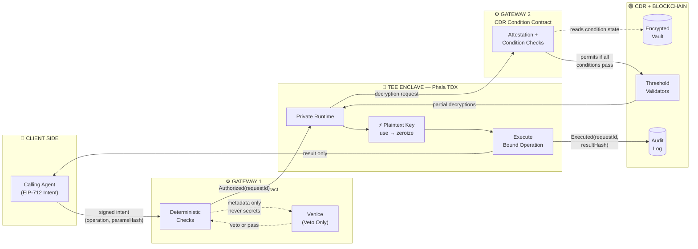

# Keyring

> **On-chain, scoped, revocable, metered, auditable access to secrets for AI agents — where the agent that asks for the secret never receives it, only the result.**

Built on the [Story Foundation CDR](https://story.foundation) Aeneid testnet.

[](https://story.foundation)
[](https://story.foundation)
[](https://phala.network)

---

## The Problem

When you deploy an autonomous agent — or subscribe to an agent service — you hand it your secrets. Exchange API keys. Database credentials. LLM billing keys. A wallet seed. These land as plaintext environment variables inside someone else's runtime, on hardware you do not own, administered by an operator you cannot audit.

There is currently **no on-chain, revocable, metered, auditable mechanism** to grant an agent *scoped* access to a secret. Your only options are:

- **Give it the raw key** — permanent exposure, no auditing, no revocation until you rotate manually
- **Build a custom proxy** — expensive, one-off, not composable, still requires trusting the proxy host
- **Don't use agents** — not the direction the world is going

The problem compounds as agent autonomy grows. An agent that can invoke your signing key, query your database, and call your APIs is an agent with unconstrained authority. If it is compromised, if its host is malicious, or if it simply makes a mistake — you have no layer between it and your most sensitive credentials.

---

## Why This Matters Now

The agent infrastructure ecosystem is forming *right now*. The primitives it adopts become load-bearing for years. Secret management is one of those primitives — and the current default ("hand it the env var") is structurally broken in ways that a rotating key schedule or a centralized secret manager cannot fix. Neither approach is:

- **On-chain and composable** — auditable by anyone, composable with any contract
- **Scoped to a specific operation** — not "access to the key," but "permission to do exactly this, once"
- **Revocable in real-time** — one transaction kills access for all future requests, globally
- **Metered by design** — the budget is enforced by the chain, not by the agent's own reporting

---

## The Key Insight

Two properties make Keyring possible:

**1. CDR gates decryption via on-chain condition contracts.** Story Foundation's Confidential Data Rails (CDR) uses threshold encryption (TDH2) where partial decryptions are only released when an on-chain condition contract returns true. Every condition — scoping, budgets, expiry, attestation — is deterministic, auditable, and composable. *All the access logic lives in those contracts.* The key itself never moves.

**2. TEE attestation proves exactly what code holds the key.** A Trusted Execution Environment (Intel TDX) with remote attestation lets a smart contract verify — cryptographically — that the code recombining partial decryptions is the exact image we published, running on real hardware, unmodified. The CDR vault is bound to open only to that enclave.

Together: an agent submits a signed request, on-chain contracts verify scope and attestation, the key briefly exists inside an attested enclave to perform exactly the permitted operation, and the agent receives only the result. **The agent never has the key. Neither does the host.**

---

## How Keyring Works

An agent holds a *grant* — a scoped, budgeted, time-windowed, revocable authorization record stored on-chain. When it needs to use a protected resource, it signs an EIP-712 intent naming the exact operation and parameters. Two on-chain condition contracts — Gateway 1 (authorization) and Gateway 2 (decryption conditions) — verify everything from the agent's identity to the enclave's hardware attestation before the secret is ever touched. The key is recombined inside the TEE, used for exactly the permitted operation, and immediately wiped. The agent receives only the result. Every step is an on-chain event.

---

## Architecture

### Three Trust Zones



**CLIENT SIDE** — the calling agent. Sends signed intents, receives results. Never sees a key.

**GATEWAY 1** — the authorization contract. Verifies the agent's identity, scope, budget, and freshness. Venice provides a fail-closed AI veto on request metadata — it can only deny, never grant.

**TEE ENCLAVE** — the only place plaintext ever exists. Phala Confidential VM on Intel TDX with hardware remote attestation. The key is recombined here, used for the one permitted operation, and immediately zeroized.

**GATEWAY 2** — the CDR condition contract. Verifies attestation, matches the authorized `requestId`, enforces single-use and TTL, re-checks revocation. This is the vault's gatekeeper.

**CDR + BLOCKCHAIN** — threshold-encrypted vault storage, validator network for partial decryptions, and the immutable on-chain audit log.

---

## Core Components

| Component | Type | Role |
|---|---|---|
| `AgentRegistry` | Solidity contract | Stores scoped agent grants: owner, agent, allowed operations, budget, time window, co-signer, revocation state |
| `AuthorizationContract` (Gateway 1) | Solidity contract | Verifies EIP-712 signed intents against the registry; records `Authorized(requestId)` on pass |
| `KeyringCondition` (Gateway 2) | Solidity CDR condition contract | CDR's `checkReadCondition`: verifies attestation, requestId match, single-use, TTL, kill-switch, resource match |
| TEE Runtime | TypeScript (Phala CVM) | Recombines CDR partial decryptions, executes bound operation, zeroizes key material, returns result |
| Venice Veto | External API call | Fail-closed LLM circuit breaker — sees only request metadata, never secrets |
| Dashboard | Next.js 15 (App Router) | Issue grants, monitor budget in real time, trigger kill-switch, view audit trail |

---

## End-to-End Workflow

### Step 1 — Sign Intent

The calling agent builds an EIP-712 typed-data struct:

```
{
  grantId,       // which grant this request is under
  operation,     // the specific permitted operation (e.g. "sign_tx")
  resourceId,    // the specific vault / resource being accessed
  paramsHash,    // keccak256(exact operation parameters)
  nonce,         // single-use replay prevention
  deadline,      // expiry timestamp
  chainId        // chain binding
}
```

Signs with its registered private key. The `paramsHash` binds the authorization to one specific set of parameters — it cannot be reused for different calldata.

### Step 2 — Gateway 1: Request Authorization

The authorization contract runs nine deterministic checks (see [Gateway 1 details](#gateway-1-request-authorization)). On pass, it records `Authorized(requestId, agent, paramsHash, expiry)` on-chain.

After the deterministic pass, request metadata — never secrets — goes to Venice for a fail-closed AI veto. A Venice denial aborts the request.

### Step 3 — TEE Requests Decryption

The private runtime inside the Phala TDX enclave presents the `requestId` to the CDR condition contract and requests the encrypted vault.

### Step 4 — Gateway 2: Decryption Conditions

The CDR condition contract evaluates eight conditions (see [Gateway 2 details](#gateway-2-decryption-conditions)), including hardware attestation of the enclave. On pass, the CDR validator network is permitted to release partial decryptions.

### Step 5 — Recombination

CDR validators release partial decryptions to the enclave. The runtime recombines them into the plaintext key — held in a wipeable `Buffer`, never a JS `string`. **This is the only moment plaintext exists, anywhere.**

### Step 6 — Execute Bound Operation

The runtime performs only the operation bound by `paramsHash`: sign a transaction, call an external API, decrypt a payload. No other operation is possible within this request.

### Step 7 — Return, Zeroize, Record

The result is returned to the calling agent. Key material is immediately zeroized (`Buffer.fill(0)`). The `requestId` is marked consumed on-chain. `Executed(requestId, resultHash)` is emitted to the audit log.

---

## Gateway 1: Request Authorization

Gateway 1 evaluates nine deterministic checks before recording an approval. Every check is on-chain state — no off-chain assumptions.

| # | Check | How it works |
|---|---|---|
| 1 | **Authenticity** | `ecrecover(EIP-712 digest, sig) == registry.agentOf(grantId)` — proves the request came from the registered agent, not a name it claims |
| 2 | **Ownership binding** | `registry.ownerOf(grantId) == user` — the grant belongs to the right owner |
| 3 | **Scope** | `operation ∈ grant.scope` and `resourceId ∈ grant.resources` — the agent is explicitly authorized for this operation on this resource |
| 4 | **Freshness / anti-replay** | `nonce` is unused (marked consumed); `block.timestamp ≤ deadline`; `chainId` matches — prevents replay attacks |
| 5 | **Budget** | Decrement use-counter or spend cap; reject if exhausted — enforced by the contract, not by the agent's self-reporting |
| 6 | **Time window** | `notBefore ≤ block.timestamp ≤ notAfter` — the grant is valid at this moment |
| 7 | **Kill-switch** | `!grant.revoked` — a single owner transaction can block all future access immediately |
| 8 | **Co-sign / quorum** | For high-value operations: verify a second EIP-712 signature from `coSigner` or m-of-n quorum |
| 9 | **paramsHash binding** | The approval is bound to the exact operation parameters — cannot be reused for different calldata |

---

## Gateway 2: Decryption Conditions

Gateway 2 is the CDR condition contract — the `checkReadCondition` implementation that the CDR validator network evaluates before releasing partial decryptions. **This is the technical core of Keyring.**

The vault opens **only if all eight conditions pass simultaneously:**

| # | Condition | Why it matters |
|---|---|---|
| 1 | **Authorization exists & matches** | `Authorized[requestId]` is present on-chain, and the presented `paramsHash` matches exactly — no authorization can be substituted |
| 2 | **Caller is the private runtime** | Partial decryptions are released only to the TEE's key — the secret decrypts *to the attested enclave*, never to the calling agent |
| 3 | **Single-use** | `requestId` has not been used for decryption before; marked consumed on read — prevents replay of a valid authorization |
| 4 | **Tight TTL** | Decryption must occur within ~60 seconds of authorization — stale approvals expire and cannot be acted on |
| 5 | **Kill-switch re-check** | `!grant.revoked` — a revocation landing between Gateway 1 and Gateway 2 still blocks decryption |
| 6 | **Budget decrement** | The on-chain read is the metered event — budget is consumed at the moment of decryption |
| 7 | **Resource match** | `vault.resourceId == authorized.resourceId` — the vault being opened is the one that was authorized |
| 8 | **Attestation verified** | The decryptor is bound to a verified Phala/TDX attestation of our published Docker image hash — the vault only opens to the exact, unmodified enclave |

Every passing read emits an on-chain event. The full audit trail is permanent, public, and requires no trusted party to maintain.

---

## Execution & Teardown

**Single-use by design.** Each `requestId` can be consumed exactly once at Gateway 2. An agent that needs to perform the same operation again must go through the full Gateway 1 → Gateway 2 cycle. There is no standing session.

**Key material handling.** The plaintext key is held exclusively in a `Buffer` (or `Uint8Array`) and `.fill(0)`'d immediately after use. It is never assigned to a JavaScript `string` — strings are immutable, live on the heap indefinitely, and cannot be securely wiped. The crypto operation runs in a short-lived worker that can be killed to reclaim the entire address space.

**On-chain record.** After zeroization, `Executed(requestId, resultHash)` is emitted. The result hash provides tamper-evident evidence of what operation was performed, without revealing the result or the key.

**"Agent no longer has access"** is enforced structurally: the single-use `requestId` is consumed, the TTL has expired, and no plaintext was retained. The next operation requires a fresh signed intent and a fresh Gateway 1 → Gateway 2 cycle.

---

## Security Model

| Guarantee | Mechanism | Caveat |
|---|---|---|
| **Plaintext exists in exactly one place** | TEE hardware isolation; key never leaves the enclave | Plaintext exists *during* the operation — the TEE's job is to make "somewhere" be an attested enclave nobody can observe |
| **The agent never has the key** | CDR partial decryptions are released only to the TEE's key; result-only return path | If the enclave is compromised, the guarantee fails — hence remote attestation and minimal TCB |
| **Venice can only deny, never grant** | Venice sees only request metadata; deterministic on-chain contracts are the sole approval authority | A veto-only judge means the worst a fooled AI can cause is a wrongful *denial*, not an unauthorized grant |
| **Revocation is real-time** | Kill-switch re-checked at Gateway 2; single-use `requestId`s; no standing plaintext | Revocation is before-reveal. Knowledge already revealed cannot be clawed back — physics, not a design flaw. Per-use gating is the mechanism, not one-shot reveals |

### Trusted Computing Base

Only the few hundred lines that recombine CDR partials, execute the bound operation, and zeroize the key run inside the TEE. Gateway contracts, Venice integration, and the dashboard run normally with no access to secrets.

---

## Honest Limitations

- **Aeneid is not a production confidentiality environment.** The demo uses dummy/testnet keys. The waitlist is for production intent. Do not use Keyring with live production secrets on Aeneid testnet.

- **TEEs relocate trust; they do not eliminate it.** Trust moves to the hardware vendor (Intel) and the open-source dstack/Phala stack. This is a large, real reduction in attack surface — but it is not "unhackable." TEEs have a documented side-channel history (Foreshadow, Plundervolt, ÆPIC, Downfall). The threat model is a malicious *host operator*, not a funded hardware attacker.

- **Plaintext exists during the operation.** That is not a flaw; it is why the TEE is necessary. "Wiped after" is not "never seen" — it means "seen only by an attested enclave with a minimal trusted computing base."

- **Revocation cannot clawback already-revealed secrets.** The system is designed around this constraint: per-use gating means the enclave must return to the CDR network for each operation. Revoke between operations and the next one fails. The already-executing operation completes.

- **CDR does not compute over ciphertext.** Keyring gates *decryption*; it does not perform private inference, private queries, or homomorphic operations on sealed data. Those are future CDR roadmap features, not available on Aeneid today.

---

## Tech Stack

| Layer | Technology | Role |
|---|---|---|
| Blockchain | Story Protocol / Aeneid testnet | Settlement, condition evaluation, audit trail, agent registry |
| Confidential storage | CDR (TDH2 threshold encryption) | Threshold-encrypted vault storage; partial-decryption release gated by condition contracts |
| Condition contracts | Solidity | `AgentRegistry`, `AuthorizationContract` (G1), `KeyringCondition` / `checkReadCondition` (G2) |
| TEE host | Phala Cloud / dstack / Intel TDX | Confidential VM with hardware remote attestation; free tier for demo |
| TEE runtime | TypeScript | Partial decryption recombination, operation execution, secure zeroization |
| AI veto | Venice AI | Fail-closed LLM circuit breaker on request metadata; private inference, no server-side prompt logging |
| Frontend | Next.js 15 (App Router) | Grant issuance, real-time budget monitoring, kill-switch, audit trail viewer |
| Auth / signing | EIP-712 | Typed structured signing for agent intents; co-signer support for high-value operations |
| Dev / test | dstack local simulator | Local attestation simulation for development without burning free CVM credits |

---

## Hackathon: Story Foundation CDR Hackathon (Aeneid)

Keyring is built for the Story Foundation CDR hackathon on the Aeneid testnet, targeting both prize tracks.

### Best Technical Achievement

The technical track rewards advanced conditions, new programmable-permission patterns, and smart contracts enforcing complex conditional access. Keyring's Gateway 2 condition contract delivers:

- **On-chain attestation verification** — `checkReadCondition` verifies the Phala/TDX hardware attestation report, binding vault access to a specific published Docker image hash
- **Multi-layered composable conditions** — nine authorization checks in Gateway 1 plus eight decryption conditions in Gateway 2 compose into a single coherent access decision
- **Stateful revocation interlock** — kill-switch state is re-evaluated at decryption time, so a revocation between G1 and G2 still blocks the operation
- **paramsHash binding** — authorizations are cryptographically bound to exact operation parameters, preventing reuse across different calldata
- **Co-signer / quorum patterns** — high-value operations require multi-signature authorization, implemented as a first-class Gateway 1 condition

### Best CDR Application

The product track rewards real traction and evidence that someone would use this more than once. Keyring's demo story:

- A deployed agent with a scoped signing grant — watch the budget decrement live with each request
- The kill-switch demo — one transaction, immediate effect on the next inbound request
- The audit trail — every operation is public, permanent, and requires no trusted third party to maintain
- A waitlist for teams that want scoped, auditable, revocable agent access in production

---

## Glossary

| Term | Meaning |
|---|---|
| **CDR** | Confidential Data Rails — Story Foundation's threshold-encrypted vault system whose decryption is gated by on-chain condition contracts |
| **TDH2** | The threshold encryption scheme underlying CDR; partial decryptions are combined client-side into plaintext |
| **Condition contract** | The on-chain `checkReadCondition` / `checkWriteCondition` that decides whether a vault may be decrypted; where all access logic lives |
| **TEE / CVM** | Trusted Execution Environment / Confidential VM — hardware-isolated execution; Keyring uses Phala's CVM on Intel TDX |
| **Remote attestation** | A hardware-signed proof that the enclave is running the exact published code, unmodified; verifiable on-chain |
| **EIP-712 intent** | A typed, structured, signed request that proves agent identity and binds exact operation parameters |
| **paramsHash** | `keccak256` of concrete operation parameters; binds an authorization to one specific action |
| **Gateway 1** | The request-authorization contract that evaluates nine deterministic checks and records `Authorized(requestId)` on pass |
| **Gateway 2** | The CDR condition contract that evaluates eight decryption conditions including attestation before permitting the vault to open |
| **Venice veto** | The fail-closed LLM circuit breaker bolted onto Gateway 1; can only deny requests, never approve them |
| **Zeroize** | Overwriting key material in memory (`Buffer.fill(0)`) immediately after use so it cannot be recovered from a heap dump |
